# Atlas Gatweay

## Motivation

Atlas Gateway is your ultimate gateway to explore the world. Designed to deliver a seamless experience. The platform serves a wide spectrum of users, including Tourists, Tour Guides, Advertisors, Sellers, and Governors.

It is a way to help users plan their trips. It was designed to be a one-stop solution for all travel-related needs, including itinerary and activity planning, booking flights, arranging transportations, and hotel booking.

Whether you're exploring historic landmarks, relaxing on beaches, or planning family-friendly adventures, this app brings everything together for the perfect trip.

Want to shop for souvenirs and gifts on the go? Our marketplace connects you with local sellers, ensuring you take home cherished memories.

To enhance user satisfaction, the platform also provides features for reviews and complaints, ensuring continuous improvement and a better experience for all.

---
## Badges


---

## Build Status

The project is currently under development. The backend is complete, and the frontend is in progress. The project is expected to be completed by the end of the month.

---

## Code Style

The code adheres to clean and modular practices, ensuring readability and maintainability. Following conventions were applied:

- **Frontend:** React.js using TypeScript and Tailwind CSS
- **Backend:** Node.js with Prettier formatting rules
- **Database:** MongoDB with Mongoose
- **Testing:** End-to-end testing and Postman

---

## Screenshots

### Application Interface

<details>
<summary> Login Page</summary>  

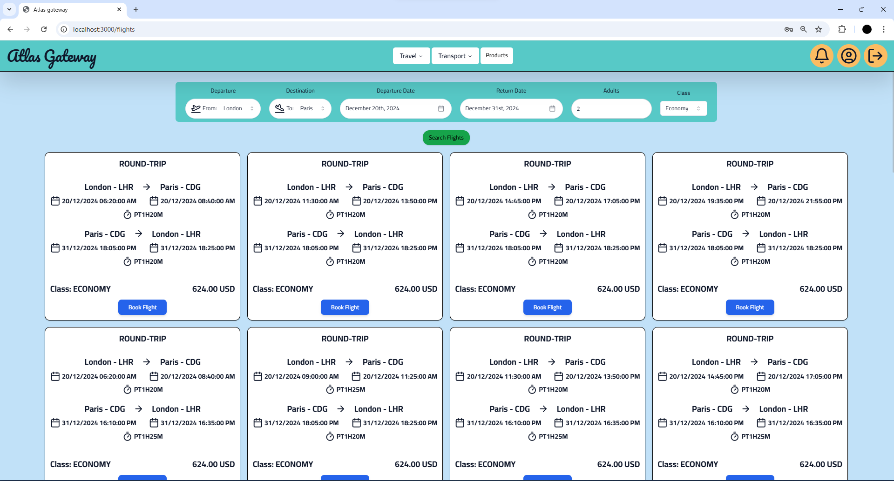
</details>

<details>
<summary>Home Page</summary>  

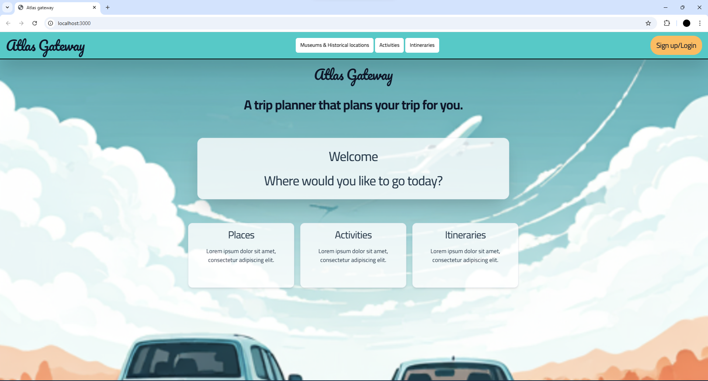
</details>


<details>
<summary>Itineraries List Page</summary>  

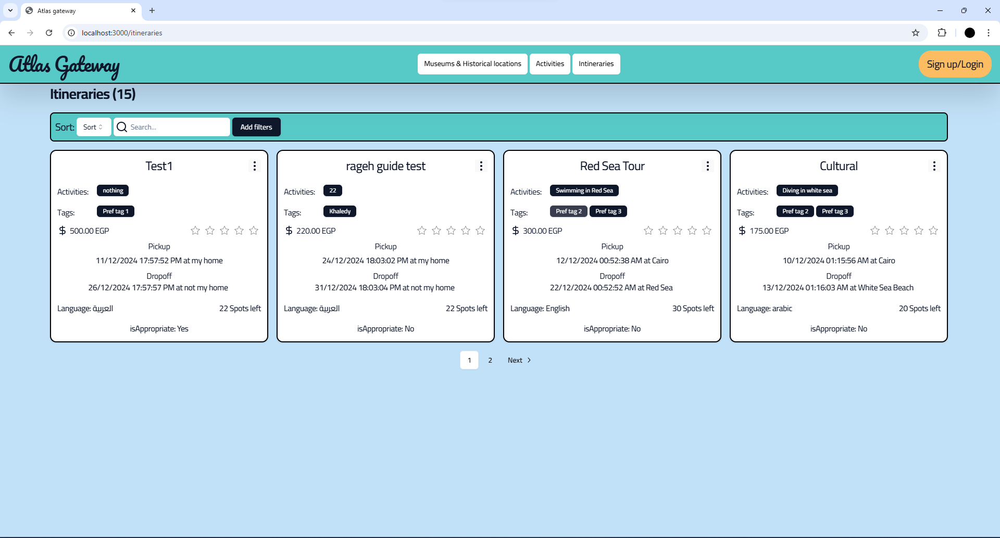
</details>

<details>

<summary>Activities List Page</summary>  

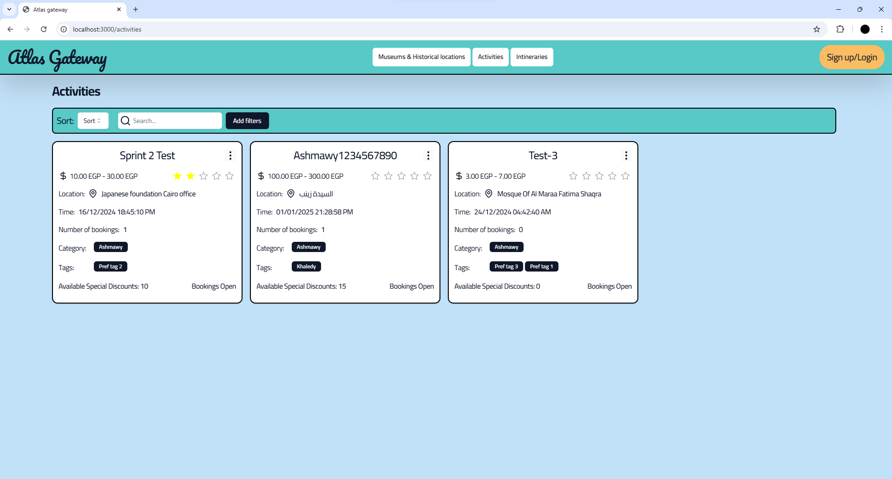

</details>

<details>

<summary>Flights Page</summary>  
	

 
</details>

<details>

<summary>Hotels Page</summary>  
	
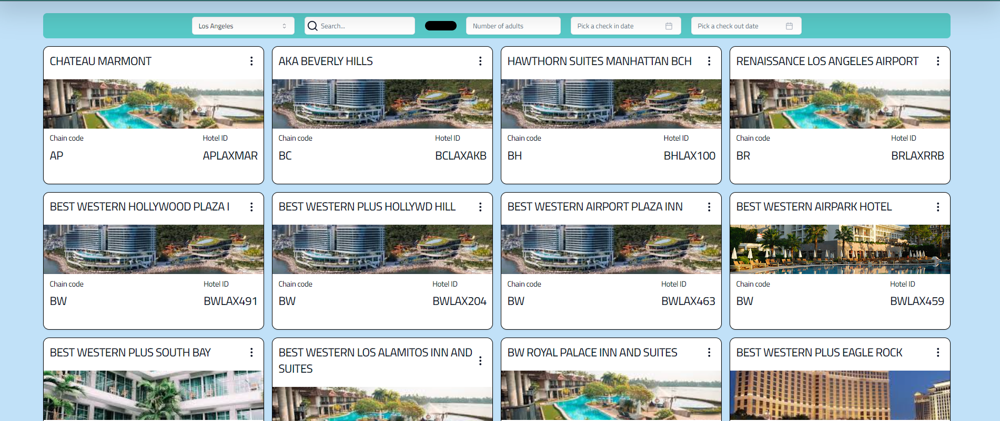
 
</details>

<details>

<summary>Profile Page</summary>  

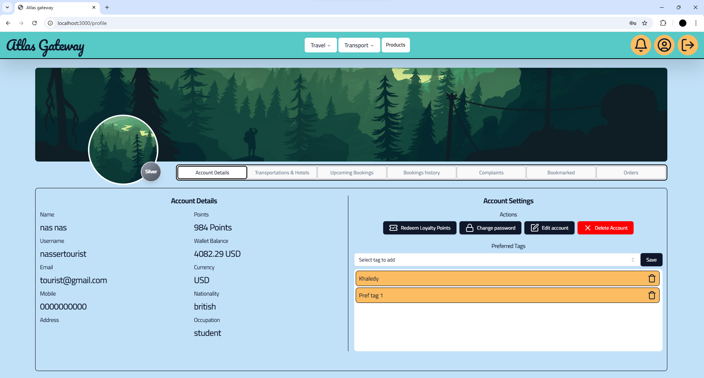
 
</details>

<details>

<summary>Admin Page</summary>  

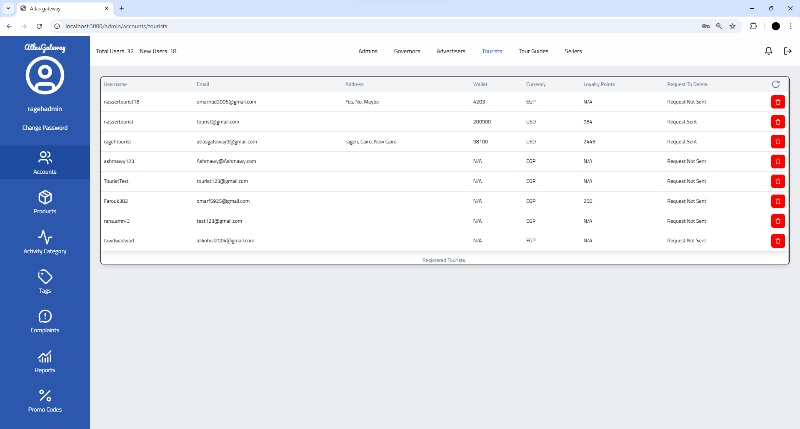
 
</details>

<details>

<summary>Admin Reports</summary>  

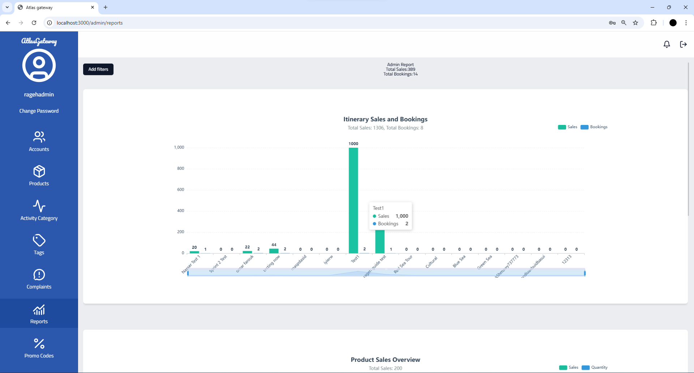

</details>

---

## Tech/Framework used

[Git](https://git-scm.com/)

[Node.js](https://nodejs.org/en/)

[Express.js](https://expressjs.com/)

[React](https://reactjs.org/)

[TypeScript](https://www.typescriptlang.org/)

[Tailwind CSS](https://tailwindcss.com/)

[MongoDB](https://www.mongodb.com/)

[Mongoose](https://mongoosejs.com/)

[MongoDB Atlas](https://www.mongodb.com/cloud/atlas)

[Postman](https://www.postman.com/)

[VSCode](https://code.visualstudio.com/)

---

## Features

- User authentication and secure session management
- Dynamic trip planning with customizable options
- Payment integration using Stripe
- Mobile-responsive design with Tailwind CSS
- The Site serves Variety of features to each user :


<details>
<summary>As a Tourist</summary>

- **User Account**
  - Login using username and password.
  - Change password.
  - View profiles of others.

- **Search and Filter**
  - **General Search:**
    - Search for specific museums, historical places, activities, or itineraries by name, category, or tag.
    - Search for products based on product name.
  - **Filter Options:**
    - **Activities/Itineraries:**
      - Filter by budget, date, category, ratings, preferences (e.g., historic areas, beaches, family-friendly, shopping), and language.
    - **Historical Places/Museums:**
      - Filter by tag.
    - **Products:**
      - Filter by price.
  - **Sort Options:**
    - **Activities/Itineraries:**
      - Sort by price or ratings.
    - **Products:**
      - Sort by ratings.

- **Activities and Itineraries**
  - View all upcoming activities, itineraries, historical places, and museums.
  - Bookmark (save) events to view later.
  - View a list of all saved events.
  - View all upcoming or past activities/itineraries paid for.
  - Book an event/activity or itinerary.
  - Cancel a booking 48 hours before the start of the event/activity or itinerary.
  - Rate events/activities attended.
  - Receive loyalty points upon payment for events/itineraries.
  - Redeem loyalty points for cash in the wallet.
  - Choose currency to view prices in.

- **Historical Places and Museums**
  - Filter historical places/museums by tag.

- **Products**
  - View all available products, including:
    - Picture, price, description, seller, ratings, and reviews.
  - Save products to a wishlist.
  - View wishlist of products.
  - Remove items from the wishlist.
  - Add items to the cart from the wishlist.
  - Add/remove/change item quantity in the cart.
  - Pay for products using credit card (via Stripe), wallet, or cash on delivery.
  - Review purchased products.

- **Transportation and Booking**
  - Book a flight or hotel using a third-party application (not a link).
  - Book transportation through transportation advertisers.

- **Complaints**
  - File a complaint with a title, body (problem), and date.
  - View a list of all issued complaints and their status (pending/resolved).

- **Payments and Wallet**
  - Pay online for events/activities, itineraries, or products using:
    - Credit/debit cards (via Stripe), wallet, or cash on delivery.
  - Use promo codes for discounts.
  - Receive a payment receipt via email upon successful payment.
  - View an updated wallet balance after making a payment.

- **Ratings and Reviews**
  - Rate tour guides after completing a tour.
  - Rate events/activities attended.
  - Review purchased products.

- **Notifications**
  - Receive notifications.

- **Rewards and Badges**
  - Receive loyalty points for payments.
  - Redeem points for wallet cash.
  - Earn badges based on user level.

</details>

<details>
<summary>As an Admin</summary>

- **User Management**
  - Login using username and password.
  - Delete any account from the system.
  - View accounts marked for deletion.
  - Add another admin.
  - Add a tourism governor.
  - View the total number of users and new users per month.
  - Forget password using an OTP sent to email.

- **Activity and Tag Management**
  - CRUD (Create, Read, Update, Delete) an activity category.
  - CRUD a preference tag.

- **Product Management**
  - Search for a product by name.
  - Search for a product by price.
  - Sort products by ratings.
  - Add a new product to the system.
  - Edit product details.
  - View available quantity and sales of each product.
  - Upload product images.
  - Archive/Unarchive a product.

- **Complaint Management**
  - View a list of all complaints and their statuses.
  - View details of a selected complaint.
  - Reply to any complaint.
  - Mark complaints as pending/resolved.
  - Sort complaints by date.
  - Filter complaints by status.

- **Event/Itinerary Management**
  - Flag an event or itinerary deemed inappropriate (flagged events become invisible to tourists/guests).

- **Sales and Revenue**
  - View a sales report with revenues from:
    - Events, itineraries, and gift shop sales.
  - Filter the sales report by product, date, or month.

- **Promo Codes**
  - Create promo codes.

</details>

<details>
<summary>As an Advertiser</summary>

- **User Account**
  - Login using username and password.
  - Change password.
  - Forget password using an OTP sent to email.
  - Accept the terms and conditions if approved as an advertiser on the system.

- **Profile Management**
  - Create, read, update profile information as a company, including:
    - Link to website.
    - Hotline.
    - Company profile.

- **Activity/Itinerary Management**
  - Create, read, update, delete activities or itineraries, including:
    - Date, time, location (using Google Maps).
    - Price (or price range).
    - Category and tags.
    - Special discounts.
    - Booking status (open/closed).
  - View a list of all created activities, itineraries, museums, and historical places.
  - Upload pictures for activities or itineraries.

- **Reports and Analytics**
  - View a sales report containing total revenue.
  - Filter sales report by:
    - Activity, itinerary, date, or month.
  - View a report on the total number of tourists who:
    - Used the advertiser's itineraries.
    - Attended their activities.
  - Filter the tourist report by month.

- **Notifications**
  - Receive notifications when an event or itinerary is flagged as inappropriate:
    - On the system.
    - By email.

</details>

<details>
<summary>As a Guest</summary>

- **Registration**
  - Register (sign up) as a tourist with:
    - Email, username, password, mobile number, nationality, date of birth, and job/student status.
  - Register (sign up) as a tour guide, advertiser, or seller with:
    - Username, email, and password.

- **Explore Activities and Places**
  - View all upcoming activities, itineraries, historical places, and museums.
  - Choose a category of activities.

- **Search and Filter**
  - **Activities/Itineraries:**
    - Filter by:
      - Budget, date, category, ratings, preferences (e.g., historic areas, beaches, family-friendly, shopping), and language.
    - Sort by:
      - Price or ratings.
  - **Historical Places/Museums:**
    - Filter by tag.

</details>

<details>
<summary>As a Seller</summary>

- **Profile Management**
  - Create, read, and update profile information as a seller, including:
    - Name and description.
  - Accessible only if approved as a seller on the system.
  - Accept the terms and conditions if approved on the system.
  
- **Product Management**
  - Search for products by name.
  - Filter products by price.
  - Sort products by ratings.
  - Add a product with:
    - Details, price, and available quantity.
  - Edit product details and price.
  - Upload product image and other pictures.
  - View available quantity and sales of each product.
  - Archive or unarchive a product.

- **Sales and Revenue**
  - View a sales report containing total revenue.
  - Filter the sales report by:
    - Product, date, or month.

- **Account Management**
  - Change password.

</details>

<details>
<summary>As a Tour Guide</summary>

- **User Account**
  - Login using username and password.
  - Change password.
  - Forget password using an OTP sent to email.
  - Request account deletion from the system.
  - Accept the terms and conditions if approved as a tour guide.

- **Profile Management**
  - Create, read, and update profile information as a tour guide, including:
    - Mobile number, years of experience, previous work (if applicable).
  - Accessible only if accepted as a tour guide on the system.

- **Itinerary Management**
  - Create, read, update, and delete itineraries, including:
    - Activities, locations to be visited, timeline, duration of each activity, language of the tour, price, available dates and times, accessibility, and pick-up/drop-off location.
  - View a list of all created activities, itineraries, museums, and historical places.
  - Activate or deactivate itineraries with bookings.

- **Sales and Revenue**
  - View a sales report containing total revenue.
  - Filter the sales report by:
    - Activity, itinerary, date, or month.
  - View a report on the total number of tourists who used your itinerary or attended your activity.
  - Filter the tourist report by month.

</details>

<details>
<summary>As a Tourism Governor</summary>

- **User Account**
  - Login using username and password.
  - Change password.
  - Forget password using an OTP sent to email.

- **Museum and Historical Place Management**
  - Create, read, update, and delete museums and historical places, including:
    - Description, pictures, location, opening hours, ticket prices.

- **Tag Management**
  - Create tags for different historical locations (e.g., type, historical period).

</details>

## Code Examples


<details>
<summary> Backend: Sample API Endpoint</summary>  

```typescript
const router = express.Router();

router.post("/create", createActivities);

export const createActivities = async (
    req: Request,
    res: Response,
    next: NextFunction,
) => {
    try {
        const advertisorId = req.headers.userid;
        
        if (!advertisorId) {
        
        throw new HttpError(400, "Tour Guide ID is required");
        }

        const activity = await activityService.createActivity(
			req.body,
			advertisorId.toString(),
		);
		res.status(201).json(activity);
	} catch (error) {
		next(error);
	}
};

export const createActivity = async (
	activity: IActivity,
	createdBy: string,
) => {
	if (!Types.ObjectId.isValid(createdBy)) {
		throw new HttpError(400, "Invalid Advertiser ID");
	}

	// Start a session for transaction management
	const session = await mongoose.startSession();

	try {
		session.startTransaction();

		// Create the new activity
		const newActivity = new Activity({
			...activity,
			createdBy: new Types.ObjectId(createdBy),
		});

		await newActivity.save({ session }); // Save to generate the ID

		// Link activity ID to the advertiser's activities array
		const advertiser = await advertiserService.getAdvertiserById(createdBy);

		if (!advertiser) {
			throw new HttpError(404, "Advertiser not found");
		}

		// Push the new activity ID to the advertiser's activities array
		await advertiser.updateOne(
			{ $push: { activities: newActivity._id } }, // Update data
			{ session }, // Pass session here
		);

		await session.commitTransaction();

		return newActivity;
	} catch (error) {
		await session.abortTransaction();
		throw error;
	} finally {
		session.endSession();
	}
};
```
</details>

<details>
<summary> Backend: Tourist Model</summary>  

```typescript
export interface ITourist extends Document {
	name: string;
	username: string;
	email: string;
	password: string;
	walletBalance: number;
	mobile: string;
	nationality: string;
	dob: Date;
	occupation: string;
	address?: string[];
	currency?: string;
	loyaltyPoints: number;
	maxCollectedLoyaltyPoints: number;
	level: number;
	profile?: {
		bio?: string;
		location?: string;
		image?: string;
	};
	bookedItineraries: Types.ObjectId[];
	bookmarkedItineraries: Types.ObjectId[];

	bookedActivities: Types.ObjectId[];
	bookmarkedActivities: Types.ObjectId[];

	bookedTransportations: Types.ObjectId[] | ITransportation[];
	bookedFlights: Types.ObjectId[] | IFlight[];
	bookedHotelOffers: Types.ObjectId[];
	purchaseProducts: Types.ObjectId[];
	wishlistproducts: Types.ObjectId[];
	isDeleted?: boolean;
	preferredTags?: Types.ObjectId[] | ITag[];
	cart: {
		product: Types.ObjectId;
		quantity: number;
	}[];
	payment: [
		{
			type: string;
			event: Types.ObjectId;
			amount: number;
		},
	];
	notifications: Types.ObjectId[];
}

const touristSchema = new Schema<ITourist>(
	{
		name: { type: String },
		username: { type: String, required: true },
		email: { type: String, required: true },
		password: { type: String, required: true },
		walletBalance: { type: Number, required: true, default: 0 },
		mobile: { type: String, required: true },
		nationality: { type: String, required: true },
		dob: { type: Date, required: true },
		occupation: { type: String, required: true },
		address: [{ type: String }],
		currency: { type: String, default: "EGP" },
		loyaltyPoints: {
			type: Number,
			default: 0,
			validate: {
				validator: function (value) {
					if (value < 0) {
						this.loyaltyPoints = 0;
						return false;
					}
					return value >= 0;
				},
				message: "Loyalty Points can't be negative",
			},
		},
		maxCollectedLoyaltyPoints: {
			type: Number,
			default: 0,
			validate: {
				validator: function (value) {
					if (value < 0) {
						this.maxCollectedLoyaltyPoints = 0;
						return false;
					}
					return value >= this.loyaltyPoints;
				},
				message:
					"Max Collected Loyalty Points can't be negative or smaller than Loyalty Points",
			},
		},
		level: { type: Number, enum: [1, 2, 3], default: 1 },
		profile: {
			bio: { type: String },
			location: { type: String },
			image: { type: String },
		},
		bookedItineraries: [{ type: Schema.Types.ObjectId, ref: "Itinerary" }],
		bookmarkedItineraries: [
			{ type: Schema.Types.ObjectId, ref: "Itinerary" },
		],

		bookedActivities: [{ type: Schema.Types.ObjectId, ref: "Activity" }],
		bookmarkedActivities: [
			{ type: Schema.Types.ObjectId, ref: "Activity" },
		],

		bookedTransportations: [
			{ type: Schema.Types.ObjectId, ref: "Transportation" },
		],
		bookedFlights: [{ type: Schema.Types.ObjectId, ref: "Flight" }],
		purchaseProducts: [{ type: Schema.Types.ObjectId, ref: "Product" }],
		wishlistproducts: [{ type: Schema.Types.ObjectId, ref: "Product" }],

		bookedHotelOffers: [
			{ type: Schema.Types.ObjectId, ref: "HotelBooking" },
		],
		isDeleted: { type: Boolean, default: false },
		preferredTags: [
			{ type: Schema.Types.ObjectId, ref: "Tag", required: true },
		],
		payment: [
			{
				type: { type: String },
				event: { type: Schema.Types.ObjectId },
				amount: { type: Number },
			},
		],
		cart: [
			{
				product: { type: Schema.Types.ObjectId, ref: "Product" },
				quantity: { type: Number, required: true },
			},
		],
		notifications: [{ type: Schema.Types.ObjectId, ref: "Notification" }],
	},
	schemaConfig,
);

export const Tourist = model<ITourist>("Tourist", touristSchema);


```
</details>

<details>
<summary> Frontend: Flight Booking </summary>  

```typescript

const Flights = () => {
	const [flights, setFlights] = useState<IFlight[]>([]);

	const addFlight = (newFlight: IFlight) => {
		setFlights((prevFlights) => [...prevFlights, newFlight]);
	};
	const removeFlights = () => {
		setFlights([]);
	};
	return (
		<Flex isColumn gap="4" className="w-full h-full">
			<div className="self-center">
				<SearchForm
					addFlight={addFlight}
					removeFlights={removeFlights}
				/>
			</div>
			<Flex
				className="grid lg:grid-cols-4 md:grid-cols-3 sm:grid-cols-2"
				gap="4"
			>
				{flights.map((flight, index) => (
					<FlightsCard key={index} {...flight} />
				))}
			</Flex>
		</Flex>
	);
};

```
</details>

<details>
<summary> Frontend: Itineraries </summary>  

```typescript
export default function Itineraries() {
	const { user } = useLoginStore();
	const { data, meta } = useItineraries();
	const [open, setOpen] = useState(false);
	const [itinerary, setItinerary] = useState<TItinerary>();
	const { data: tags } = useTags();
	const { data: guide } = useTourGuideProfile();

	const openEditDrawer = (itinerary: TItinerary) => {
		setOpen(true);
		setItinerary(itinerary);
	};

	const closeEditDrawer = (open: boolean) => {
		setOpen(open);
		if (!open) setItinerary(undefined);
	};

	const { page, onPageChange, pagesCount } = usePagination({
		pageNum: meta?.pages || 1,
		pagesCount: meta?.pages || 1,
	});

	const [query, setQuery] = useQueryString();

	return (
		<Flex isColumn gap="4" className="w-full h-full">
			<Label.Big600>
				View a list of itineraries you can follow!
			</Label.Big600>
			<Flex
				justify="between"
				gap="2"
				className="bg-surface-secondary p-2 rounded-lg border-2 border-solid border-black"
			>
				<Flex gap="1" align="center">
					<Label.Mid400>Sort:</Label.Mid400>
					<Select
						onValueChange={(value) => {
							if (value === "0") {
								setQuery({
									...query,
									sort: undefined,
								});
							} else {
								setQuery({
									...query,
									sort: value,
								});
							}
						}}
					>
						<SelectTrigger className="bg-white">
							<SelectValue placeholder="Sort" />
						</SelectTrigger>
						<SelectContent>
							<SelectItem value="0">None</SelectItem>
							<SelectItem value="avgRating,1">
								Ascending rating
							</SelectItem>
							<SelectItem value="avgRating,-1">
								Descending rating
							</SelectItem>
							<SelectItem value="price,1">
								Ascending price
							</SelectItem>
							<SelectItem value="price,-1">
								Descending price
							</SelectItem>
						</SelectContent>
					</Select>
					<Searchbar />
					<Filters
						filters={{
							tags: {
								filterName: "tags",
								label: "Tags",
								type: "checkbox",
								options:
									tags?.map((tag) => ({
										label: tag.name,
										value: tag._id!,
									})) || [],
							},
							date: {
								// TODO: WIP
								filterName: "date",
								label: "Date",
								type: "date",
							},
							price: {
								filterName: "price",
								label: "Price",
								type: "range",
							},
							language: {
								filterName: "language",
								label: "Language",
								type: "checkbox",
								options: languageOptions,
							},
						}}
					/>
				</Flex>
				{user?.type === EAccountType.Guide &&
					guide?.isVerified &&
					guide?.acceptedTerms && (
						<Button
							onClick={() => setOpen(true)}
							variant="default"
							className="flex gap-2"
						>
							Add Itinerary <Plus />
						</Button>
					)}
			</Flex>
			<Flex
				className="grid lg:grid-cols-4 md:grid-cols-3 sm:grid-cols-2"
				gap="4"
			>
				{data
					?.filter((itinarary: TItinerary) => {
						if (user?.type === EAccountType.Tourist) {
							const currentDate = new Date();

							if (itinarary.startDateTime) {
								const activityDate = new Date(
									itinarary.startDateTime,
								);
								return activityDate > currentDate;
							}
						}
						return true;
					})
					.map((itinerary) => (
						<ItineraryCard
							itinerary={itinerary}
							openEditDrawer={openEditDrawer}
						/>
					))}
			</Flex>
			{pagesCount > 1 && (
				<Pagination>
					{page !== 1 && (
						<PaginationPrevious
							onClick={() => onPageChange(page - 1)}
						/>
					)}
					<PaginationContent>
						{[...Array(pagesCount).keys()].map((num) => (
							<PaginationItem
								key={num}
								onClick={() => onPageChange(num + 1)}
							>
								<PaginationLink isActive={page === num + 1}>
									{num + 1}
								</PaginationLink>
							</PaginationItem>
						))}
					</PaginationContent>
					{page !== pagesCount && (
						<PaginationNext
							onClick={() => onPageChange(page + 1)}
						/>
					)}
				</Pagination>
			)}
			<ItineraryForm
				itinerary={itinerary}
				open={open}
				setOpen={closeEditDrawer}
			/>
		</Flex>
	);
}

```
</details>


## Installation

1. Clone the Project
```console
> git clone https://github.com/Advanced-computer-lab-2024/Atlas-Gateway/tree/main
```
2. Change directory to Frontend
```console
> cd Frontend
> npm i
> npm run dev
```
3. Create new window and change directory to Backend
```console
> cd backend
> npm i
> npm run dev
```

## Api Refrences 

Our API is available online as a public postman workspace that you can see and fork [here](https://www.postman.com/supply-geoscientist-41304441/atlas-gateway).
<details>
<summary>All Api Refrences Here</summary>

- Endpoint: `/api/admin/create`
  - Method: POST
  - Description: Create a new admin

- Endpoint: `/api/admin/list`
  - Method: GET
  - Description: List all admins

- Endpoint: `/api/admin/report`
  - Method: GET
  - Description: Get admin report

- Endpoint: `/api/admin/userStats`
  - Method: GET
  - Description: View number of users

- Endpoint: `/api/admin/delete/:id`
  - Method: DELETE
  - Description: Delete admin by ID

- Endpoint: `/api/advertiser/create`
  - Method: POST
  - Description: Create a new advertiser

- Endpoint: `/api/advertiser/list`
  - Method: GET
  - Description: List all advertisers

- Endpoint: `/api/advertiser/show/:id`
  - Method: GET
  - Description: Get advertiser by ID

- Endpoint: `/api/advertiser/update/:id`
  - Method: PUT
  - Description: Update advertiser by ID

- Endpoint: `/api/advertiser/delete/:id`
  - Method: DELETE
  - Description: Delete advertiser by ID

- Endpoint: `/api/activity/create`
  - Method: POST
  - Description: Create a new activity

- Endpoint: `/api/activity/list`
  - Method: GET
  - Description: List all activities

- Endpoint: `/api/activity/show/:id`
  - Method: GET
  - Description: Get activity by ID

- Endpoint: `/api/activity/update/:id`
  - Method: PUT
  - Description: Update activity by ID

- Endpoint: `/api/activity/delete/:id`
  - Method: DELETE
  - Description: Delete activity by ID

- Endpoint: `/api/category/create`
  - Method: POST
  - Description: Create a new category

- Endpoint: `/api/category/list`
  - Method: GET
  - Description: List all categories

- Endpoint: `/api/category/show/:id`
  - Method: GET
  - Description: Get category by ID

- Endpoint: `/api/category/update/:id`
  - Method: PUT
  - Description: Update category by ID

- Endpoint: `/api/category/delete/:id`
  - Method: DELETE
  - Description: Delete category by ID

- Endpoint: `/api/complaint/create`
  - Method: POST
  - Description: Create a new complaint

- Endpoint: `/api/complaint/list`
  - Method: GET
  - Description: List all complaints

- Endpoint: `/api/complaint/list-profile`
  - Method: GET
  - Description: List complaints by creator profile

- Endpoint: `/api/complaint/delete/:id`
  - Method: DELETE
  - Description: Delete complaint by ID

- Endpoint: `/api/flight/book`
  - Method: POST
  - Description: Book a flight

- Endpoint: `/api/flight/search`
  - Method: POST
  - Description: Search for flights

- Endpoint: `/api/flight/delete/:id`
  - Method: DELETE
  - Description: Delete flight by ID

- Endpoint: `/api/governor/create`
  - Method: POST
  - Description: Create a new governor

- Endpoint: `/api/governor/list`
  - Method: GET
  - Description: List all governors

- Endpoint: `/api/governor/showGoverner/:id`
  - Method: GET
  - Description: Get governor by ID

- Endpoint: `/api/governor/update/:id`
  - Method: PUT
  - Description: Update governor by ID

- Endpoint: `/api/governor/show/:id`
  - Method: GET
  - Description: Get historical locations by governor ID

- Endpoint: `/api/governor/delete/:id`
  - Method: DELETE
  - Description: Delete governor by ID

- Endpoint: `/api/hotel/bookRoom`
  - Method: POST
  - Description: Book a hotel room

- Endpoint: `/api/hotel/list/:cityCode`
  - Method: GET
  - Description: List hotels by city code

- Endpoint: `/api/hotel/myBookings`
  - Method: GET
  - Description: Get my hotel bookings

- Endpoint: `/api/hotel/show/:id`
  - Method: GET
  - Description: Show hotel details by ID

- Endpoint: `/api/hotel/delete/:id`
  - Method: DELETE
  - Description: Delete hotel booking by ID

- Endpoint: `/api/itinerary/create`
  - Method: POST
  - Description: Create a new itinerary

- Endpoint: `/api/itinerary/list`
  - Method: GET
  - Description: List all itineraries

- Endpoint: `/api/itinerary/listTourGuide`
  - Method: GET
  - Description: List itineraries by tour guide

- Endpoint: `/api/itinerary/show/:id`
  - Method: GET
  - Description: Get itinerary by ID

- Endpoint: `/api/itinerary/update/:id`
  - Method: PUT
  - Description: Update itinerary by ID

- Endpoint: `/api/itinerary/flag/:id`
  - Method: PUT
  - Description: Flag itinerary by ID

- Endpoint: `/api/itinerary/delete/:id`
  - Method: DELETE
  - Description: Delete itinerary by ID

- Endpoint: `/api/login`
  - Method: POST
  - Description: User login

- Endpoint: `/api/media/upload`
  - Method: POST
  - Description: Upload media file

- Endpoint: `/api/media/download`
  - Method: POST
  - Description: Download media file

- Endpoint: `/api/notification/create`
  - Method: POST
  - Description: Create a new notification

- Endpoint: `/api/notification/list`
  - Method: GET
  - Description: List all notifications

- Endpoint: `/api/notification/get`
  - Method: GET
  - Description: Get notifications by user ID

- Endpoint: `/api/order/create`
  - Method: POST
  - Description: Create a new order

- Endpoint: `/api/order/list`
  - Method: GET
  - Description: List all orders

- Endpoint: `/api/order/show/:id`
  - Method: GET
  - Description: Show order by ID

- Endpoint: `/api/order/cancel/:id`
  - Method: POST
  - Description: Cancel order by ID

- Endpoint: `/api/payment/createPaymentIntent`
  - Method: POST
  - Description: Create a payment intent

- Endpoint: `/api/places/create`
  - Method: POST
  - Description: Create a new place

- Endpoint: `/api/places/list`
  - Method: GET
  - Description: List all places

- Endpoint: `/api/places/listGoverner`
  - Method: GET
  - Description: List places by governor

- Endpoint: `/api/places/show/:id`
  - Method: GET
  - Description: Get place by ID

- Endpoint: `/api/places/update/:id`
  - Method: PUT
  - Description: Update place by ID

- Endpoint: `/api/places/delete/:id`
  - Method: DELETE
  - Description: Delete place by ID

- Endpoint: `/api/product/create`
  - Method: POST
  - Description: Create a new product

- Endpoint: `/api/product/list`
  - Method: GET
  - Description: List all products

- Endpoint: `/api/product/show/:id`
  - Method: GET
  - Description: Get product by ID

- Endpoint: `/api/product/update/:id`
  - Method: PUT
  - Description: Update product by ID

- Endpoint: `/api/product/delete/:id`
  - Method: DELETE
  - Description: Delete product by ID

- Endpoint: `/api/promo/create`
  - Method: POST
  - Description: Create a new promo

- Endpoint: `/api/promo/list`
  - Method: GET
  - Description: List all promos

- Endpoint: `/api/promo/delete/:id`
  - Method: DELETE
  - Description: Delete promo by ID

- Endpoint: `/api/register/create`
  - Method: POST
  - Description: User registration

- Endpoint: `/api/review/add`
  - Method: POST
  - Description: Add a review

- Endpoint: `/api/review/list`
  - Method: GET
  - Description: List all reviews

- Endpoint: `/api/seller/create`
  - Method: POST
  - Description: Create a new seller

- Endpoint: `/api/seller/list`
  - Method: GET
  - Description: List all sellers

- Endpoint: `/api/seller/show/:id`
  - Method: GET
  - Description: Get seller by ID

- Endpoint: `/api/seller/update/:id`
  - Method: PUT
  - Description: Update seller by ID

- Endpoint: `/api/seller/delete/:id`
  - Method: DELETE
  - Description: Delete seller by ID

- Endpoint: `/api/tag/historical/create`
  - Method: POST
  - Description: Create a historical tag

- Endpoint: `/api/tag/historical/list`
  - Method: GET
  - Description: List all historical tags

- Endpoint: `/api/tag/preference/create`
  - Method: POST
  - Description: Create a preference tag

- Endpoint: `/api/tag/preference/list`
  - Method: GET
  - Description: List all preference tags

- Endpoint: `/api/tourGuide/create`
  - Method: POST
  - Description: Create a new tour guide

- Endpoint: `/api/tourGuide/list`
  - Method: GET
  - Description: List all tour guides

- Endpoint: `/api/tourGuide/show/:id`
  - Method: GET
  - Description: Get tour guide by ID

- Endpoint: `/api/tourGuide/update/:id`
  - Method: PUT
  - Description: Update tour guide by ID

- Endpoint: `/api/tourGuide/delete/:id`
  - Method: DELETE
  - Description: Delete tour guide by ID

- Endpoint: `/api/tourist/create`
  - Method: POST
  - Description: Create a new tourist

- Endpoint: `/api/tourist/list`
  - Method: GET
  - Description: List all tourists

- Endpoint: `/api/tourist/show/:id`
  - Method: GET
  - Description: Get tourist by ID

- Endpoint: `/api/tourist/update/:id`
  - Method: PUT
  - Description: Update tourist by ID

- Endpoint: `/api/tourist/redeem/:id`
  - Method: PUT
  - Description: Redeem points by tourist ID

- Endpoint: `/api/tourist/delete/:id`
  - Method: DELETE
  - Description: Delete tourist by ID

- Endpoint: `/api/transportation/create`
  - Method: POST
  - Description: Create a new transportation

- Endpoint: `/api/transportation/list`
  - Method: GET
  - Description: List all transportations

- Endpoint: `/api/transportation/get/:id`
  - Method: GET
  - Description: Get transportation by ID

- Endpoint: `/api/transportation/listAdvertisor`
  - Method: GET
  - Description: List transportations by advertiser

- Endpoint: `/api/transportation/update/:id`
  - Method: PUT
  - Description: Update transportation by ID

- Endpoint: `/api/transportation/delete/:id`
  - Method: DELETE
  - Description: Delete transportation by ID

- Endpoint: `/api/transportation_advertiser/create`
  - Method: POST
  - Description: Create a new transportation advertiser

- Endpoint: `/api/transportation_advertiser/list`
  - Method: GET
  - Description: List all transportation advertisers

- Endpoint: `/api/transportation_advertiser/delete/:id`
  - Method: DELETE
  - Description: Delete transportation advertiser by ID
</details>

## Tests 
All of our tests were done using Postman 

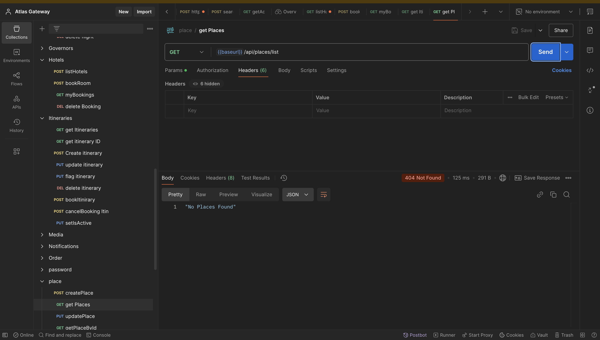

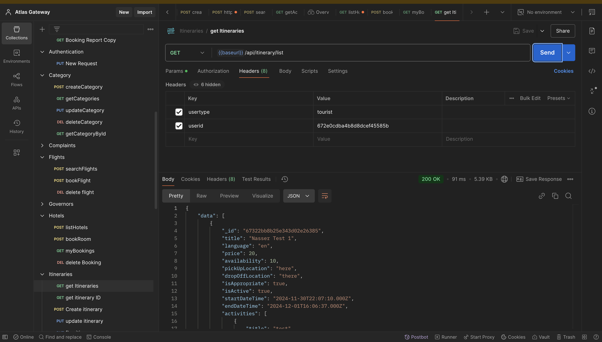

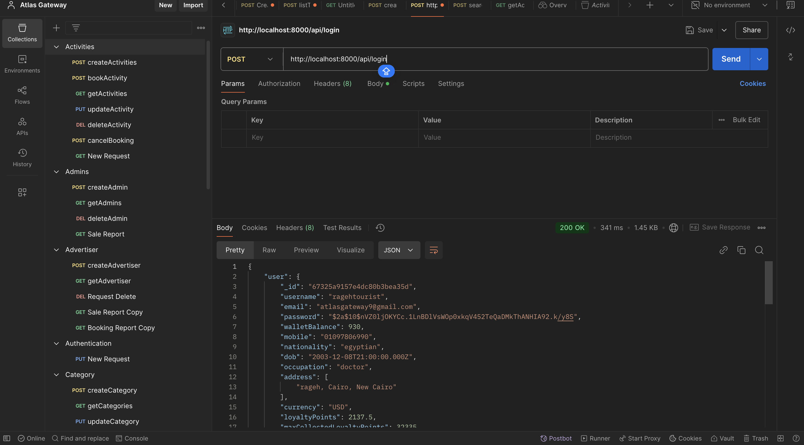

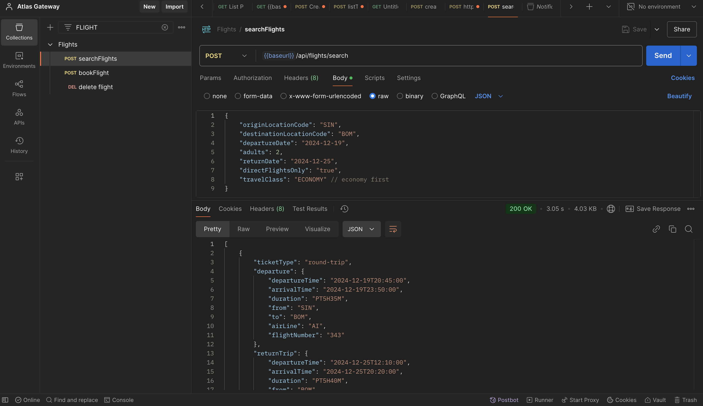

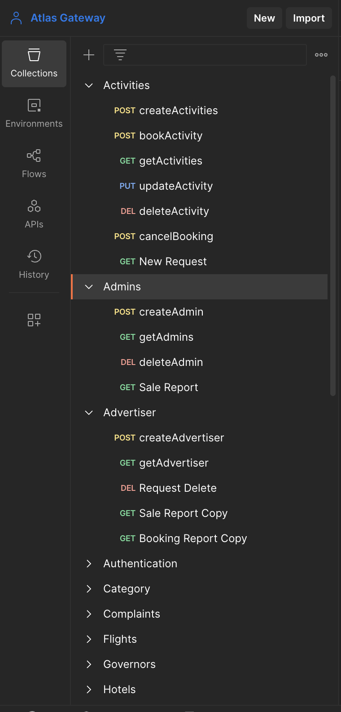

## How To Use
Before running the project, ensure you have the required environment variables set up. You'll need to create two .env files—one for the backend and one for the frontend. These files store sensitive configuration values.
<details>
<summary>Backend env</summary>

`MONGO_DB_URI`

`AWS_ACCESS_KEY_ID`

`AWS_SECRET_ACCESS_KEY`

`AWS_REGION`

`AWS_BUCKET_NAME`

`AMADEUS_CLIENT_ID`

`AMADEUS_CLIENT_SECRET`

`AMADEUS_TOKEN`

`STRIPE_SECRET_KEY`

`SYSTEM_EMAIL`

`SYSTEM_EMAIL_APP_PASSWORD`
</li>
</details>

<details>
<summary>Frontend env</summary>

`VITE_STRIPE_PUBLISHABLE_KEY`
</details>

## Contribute
We welcome contributions to improve our project!

 Want to get started ?!
 
- Fork the repository
- Clone the repository
- Install dependencies
- Create a new branch
- Make your changes
- Commit and push your changes
- Create a pull request
- Wait for your pull request to be reviewed and merged

## Credits

[Software Developer Diaries]("https://www.youtube.com/@SoftwareDeveloperDiaries")

[Bro Code]("https://www.youtube.com/channel/UC4SVo0Ue36XCfOyb5Lh1viQ")

[Stripe Docs]("https://docs.stripe.com")

## License
Copyright 2024 Atlas Gateway

Licensed under the Apache License, Version 2.0 (the "License");
you may not use this file except in compliance with the License.
You may obtain a copy of the License at

    http://www.apache.org/licenses/LICENSE-2.0

Unless required by applicable law or agreed to in writing, software
distributed under the License is distributed on an "AS IS" BASIS,
WITHOUT WARRANTIES OR CONDITIONS OF ANY KIND, either express or implied.
See the License for the specific language governing permissions and
limitations under the License.

The Project is following [MIT License](https://opensource.org/license/mit) and [Apache 2.0](https://www.apache.org/licenses/LICENSE-2.0)

